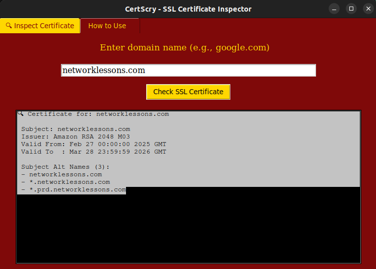

# 🔐 CertAlert – SSL Certificate Inspector

**Day 26 – Tool from #31Tools31Days challenge**

Ever wondered what’s behind that green padlock in your browser?

`CertAlert` lets you dive deep into SSL/TLS certificates for **any domain**, helping you inspect:
- Who issued the certificate?
- Who is it issued to?
- When does it expire?
- What domains are covered under it?

All without leaving your local machine. No internet APIs. No cloud dependencies. Just **pure Python and curiosity**.

---

## 🎯 Features

| Feature                            | Description                                                                 |
|------------------------------------|-----------------------------------------------------------------------------|
| 🔍 Domain SSL Inspector            | Input any domain name and fetch its live SSL certificate                   |
| 🧾 Certificate Fields               | View Issuer, Subject, Validity Dates, and SAN (Subject Alternative Names)  |
| 🧙‍♂️ Built for Learners & Analysts  | Helps you understand how HTTPS trust works                                 |
| 📖 How-To Tab                      | Simple instructions built into the tool itself                             |

---

## 🛠 Built With

- `Python 3.10+`
- `tkinter` – for GUI
- `ssl`, `socket`, `datetime` – for network and cert parsing

---

## 📸 Screenshot

 

 


---

## 🚀 How to Run

```bash
pip install -r requirements.txt
python main.py
```